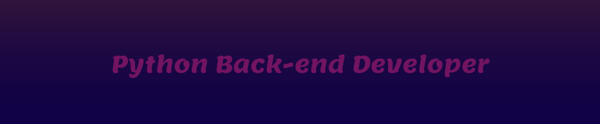

```yml
experience: 0.0

services:
    freelas:
        build:
            context: build/websites/.
            freelance: yes/Freelance
        command: /chat
        preferred_social: email
```

<br>

- 🔎 Looking for an oportunity, internship or junior

- 📚 Meanwhile, I'm a curious student

- 🧹 Currenctly Organizing my repo's

- 🙍‍♂️ He / Him / His

- 📞 [Contacts](#social-medias)

<br>

```python

class UserTest(TestCase):
    
    def setUp(self):
        self.name = "Guilherme Bracero"
        self.title = "Python Backend Developer"
        self.languages = {
            "Python": "Intermediary",
            "JavaScript": "Basic",
            } 
        self.frameworks = {
            "Django": "Intermediary",
        }
        self.tools = [
            "Git",
            "Docker",
            "PostgreSQL"
        ]
        self.available = True

    def test_aboutme(self)
        title = str(self.title.title())
        ...

```



<br>

<h1 align="center"> Tech Stacks </h1>


&nbsp;
&nbsp;
&nbsp;
&nbsp;
&nbsp;
&nbsp;


<h1 id="social-medias" align="center" >Social Medias</h1>

<br>

<p align="center">
  <a href="https://www.linkedin.com/in/guilherme-bracero/" target="_blank">
    
  </a>
  <a href="https://www.instagram.com/guilhermebracero/" target="_blank">
   
  </a>
  <a href="https://www.facebook.com/guilherme.bracerogonzales/" target="_blank">
   
  </a>
</p>

<!--
**BraceroInSabot/BraceroInSabot** is a ✨ _special_ ✨ repository because its `README.md` (this file) appears on your GitHub profile.

Here are some ideas to get you started:

- 🔭 I’m currently working on ...
- 🌱 I’m currently learning ...
- 👯 I’m looking to collaborate on ...
- 🤔 I’m looking for help with ...
- 💬 Ask me about ...
- 📫 How to reach me: ...
- 😄 Pronouns: ...
- ⚡ Fun fact: ...
-->
